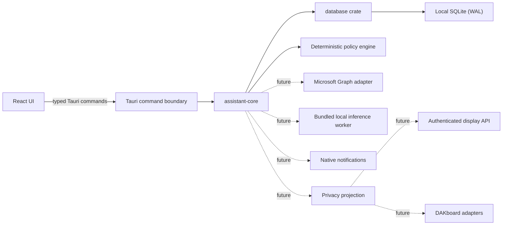
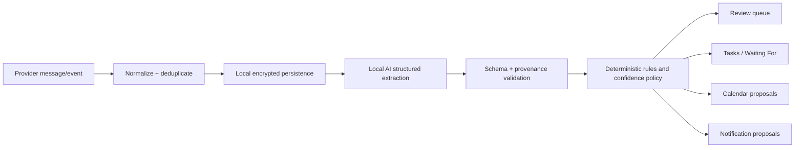

# Architecture

## Goals and constraints

The desktop application is the control centre. It is local-first, works without an account or network connection, and targets Apple Silicon macOS first while keeping UI and service boundaries portable to Windows. Tauri 2 hosts a React/TypeScript UI; trusted application services are Rust crates. The webview never opens the database directly.

The complete product specification defines a desktop control centre for work, family, school, crèche, appointments, bills, renewals, and professional deadlines. The architecture keeps provider integration, local interpretation, deterministic action policy, and shared-display projection as distinct trust boundaries.

## Repository layout

- `apps/desktop`: Tauri 2 desktop shell and React UI.
- `apps/family-display`: reserved client boundary; implementation is deferred.
- `crates/assistant-core`: domain types and use-case interfaces.
- `crates/database`: SQLite ownership, migrations, and repositories.
- `crates/{email,calendar,ai,rules,notifications,display-api}`: reserved service boundaries; no integration code is implemented yet.
- `packages/ui`: reserved cross-client design system.
- `packages/shared-types`: reserved generated wire types for future display clients.
- `tests`: cross-component and packaging tests.

## Runtime design

Commands expose narrow use cases and serialize explicit DTOs. `assistant-core` owns stable domain data. `database` owns schema evolution and transactions. Integrations remain adapter crates so Microsoft Graph, a local model runtime, and display transports cannot leak into the UI or core domain.

## Desktop application

The React application owns presentation and local view state only. It exposes the first-run wizard, Home, Today, Calendar, To Do, Waiting For, Work, Kids, Personal, Review, and Settings. Tauri commands are capability-oriented use cases, not general filesystem/database access. Long-running synchronization, inference, and notification scheduling run as managed Rust services and emit sanitized progress events.

The setup state machine contains: welcome; Microsoft connection; management areas; automation level; notifications; optional family display; local model consent/download. Setup is resumable and versioned so upgrades can introduce new consent steps without resetting completed configuration.

## Domain and action pipeline

Every extracted field carries source message IDs, evidence offsets or a derivation reason, confidence, model version, and extraction timestamp. AI output is inert data. The rules engine decides whether to ignore, suggest, queue for review, or perform an allowed idempotent operation under the selected automation policy. Important or ambiguous changes always require confirmation.

The Milestone 5 policy engine is a pure function over an explicitly validated action kind, sensitivity, confidence, source-verification state, factual-confirmation state, reversibility, user confirmation, and the user-owned policy. Its output is one of blocked, review, confirmation required, or eligible plus a stable reason code. “Eligible” remains inert data and has no execution capability; provider and notification adapters are not connected to it.

Calendar execution readiness uses the delegated `Calendars.ReadWrite` scope. The first provider slice is deliberately disconnected: a Graph adapter can create one event only at the fixed `/me/events` endpoint from bounded validated data, normalizes provider timestamps to UTC, and supplies the stable local execution key as Graph's transaction ID. No Tauri command or UI path invokes it until the append-only execution ledger and recovery state machine are complete.

Migration 17 separates immutable calendar execution preparation from one append-only terminal result. A proposal and transaction ID can each prepare at most once, and one preparation can receive at most one succeeded, failed, or unknown result. These ledgers contain identifiers and outcome codes only; display content is resolved transiently from the confirmed local item when execution is eventually connected.

## Local persistence

SQLite is opened in the OS application-data directory with WAL journaling, foreign keys, a busy timeout, and ordered migrations. Migration 1 creates a constrained singleton settings row. Writes use transactions and validation occurs at the domain boundary. Database files are excluded from source control.

The target schema is divided into accounts/provider cursors, message metadata, optionally encrypted bodies, calendars/events, tasks, waiting items, extraction records, action proposals, action audit history, rules, notices, display configurations, privacy policies, and setup/settings. Migration 11 adds the validated Conservative, Balanced (default), and Assistant policy preference plus an append-only automation audit ledger protected against update and deletion. The ledger is structural groundwork only: no executor consumes the policy yet. Provider IDs and unique constraints make synchronization and automation idempotent. Soft deletion/tombstones preserve delta-sync correctness. Secrets and encryption keys never live in SQLite.

Migration 12 adds immutable inert action proposals for offline queueing. Each proposal has a unique idempotency key and a unique foreign-key relationship to one append-only audit event. Stored fields are limited to action/sensitivity/policy/decision reason, a bounded sanitized display label, an optional opaque local target reference, confidence, and expiry; there is no executable payload or provider content. Active-list queries filter expired records without mutating history.

Migration 13 adds at most one append-only terminal event per proposal: confirm or cancel. Current state is derived at query time as pending, confirmed, cancelled, or expired, with terminal events taking precedence over later wall-clock expiry. Exact event replay is idempotent and conflicting terminal decisions fail closed. The desktop exposes a bounded queue query and explicit local confirmation dialog; confirmation does not invoke an executor.

The deterministic proposal factory runs only after an explicit accepted Review decision. Verified accepted appointments map to calendar-create proposals. Accepted tasks and waiting items map to notification proposals only when they have an effective due/scheduled/follow-up time. Stable local-item-derived keys make recovery replay safe; the original item creation time fixes proposal expiry. Critical urgency maps to Sensitive, high urgency or Work maps to Important, and remaining categories map to Routine. This factory queues inert metadata only.

The `notifications` crate now owns platform-neutral notification planning. It validates reminder, urgent-alert, morning-summary, and evening-summary requests; bounded content; privacy class/content mode; delivery horizon; quiet hours; and idempotency keys. Work-private and sensitive requests require generic content. Only a recording sink exists, so this layer cannot contact macOS notification services.

The desktop has a read-only notification-preview use case. It derives plans from active, non-completed local items and local settings, produces appointment reminders up to seven days ahead, immediate urgent previews, and fixed local-time morning/evening summaries, then applies the notification-domain validator. The UI labels every result Preview only.

The cross-platform desktop boundary retains the official Tauri notification plugin, but macOS permission and delivery use the modern native UserNotifications framework because the plugin's desktop permission result is unconditional and its legacy foreground delivery can be suppressed. The webview has no plugin notification capability. Dedicated Rust commands query real authorization, request Alert/Sound permission, and emit one fixed generic test message with foreground Banner/List/Sound presentation. The test accepts no title/body input and first appends an idempotent audit event. This proves the permission/delivery boundary without connecting the preview planner, scheduler, mailbox inference, or provider actions.

Migration 15 records a distinct default-off automatic-delivery consent in local settings. This value is intentionally separate from OS authorization and notification-type preferences. The managed scheduler requires both this consent and real OS authorization.

Migration 16 provides the scheduler recovery ledger as append-only events rather than mutable job rows. The ledger carries identifiers, kind, delivery time, and sanitized outcome only. Desired-versus-installed reconciliation remains a pure function, while platform scheduling and event persistence will be coordinated by the managed Rust service in the next connection slice.

The managed macOS notification service reconciles once per minute and immediately after Settings are saved. With real OS authorization and migration 15 consent, it derives validated plans from local data, compares them with UserNotifications pending identifiers, schedules only missing future requests, preserves installed requests across restart, and cancels stale requests after preference/consent revocation. Past scheduled identifiers are treated as satisfied so fired urgent alerts cannot be recreated repeatedly; missing future requests remain recoverable. Stable SHA-256-derived ledger event keys make reconciliation replay idempotent. A fixed one-minute test is isolated from automatic reconciliation and contains no user or email content. Settings can query only a numeric pending-automatic-request count; identifiers and content never cross into the webview.

By default the message store retains provider ID, conversation ID, sender, subject, timestamps, generated summary, extracted actions, and an original-provider link. Complete content is persisted only after explicit opt-in and is encrypted with a Keychain-held key. Backups omit raw bodies unless separately authorized.

## Microsoft Graph integration

Microsoft authentication uses the system browser and authorization-code flow with PKCE. The callback mechanism and exact least-privilege scopes will be verified against current Microsoft documentation during Milestone 2. Refresh tokens are stored in macOS Keychain behind a cross-platform credential-store interface.

The Graph adapter owns pagination, delta tokens, throttling-aware retry, token refresh, cancellation, and normalized provider errors. Inbox, sent items, and calendars synchronize independently into transactional staging batches. A cursor is advanced only after the batch commits, making interruption safe. Disconnect revokes/forgets credentials and offers local-data deletion.

## Task and calendar engine

Tasks and waiting items share traceable source references but have separate lifecycles. Waiting items record request time, expected responder/thread, age, and closure evidence. Calendar proposals distinguish tentative mentions, confirmed events, reschedules, and cancellations. Matching uses provider event IDs first and constrained time/title/participant correlation second; low-confidence matches enter Review.

Categories are WORK, SCHOOL, CRECHE, KIDS, PERSONAL, and HOME. The combined assistant calendar stores provider references and a normalized projection; it does not force underlying calendars to merge.

## Local AI architecture (Milestone 3)

The runtime is an embedded llama.cpp sidecar suitable for quantized models and Apple Metal acceleration. The Apple Silicon package pins official build b10434 and embeds its executable, dependent libraries, upstream licence, and provenance manifest in the signed application resources. The service verifies the expected runtime build before use, detects Metal at runtime, prefers GPU offload, and falls back to Accelerate-backed CPU execution when Metal is unavailable. It is invoked as a bounded child process rather than a listener and does not expose a local network service. A hardware profiler selects from a signed model manifest using RAM, CPU, Apple Silicon generation, disk space, and context needs. Models are optional first-run downloads, hash/signature verified, resumable, stored in Application Support, removable, and never executable.

The current catalog is compiled into the signed application and pins official Apache-2.0 Qwen3 GGUF files by immutable repository revision, byte length, and SHA-256. Downloads accept only an allowlist of TLS hosts, cap redirects and duration, resume into an application-owned `.part` file, reject overrun or truncation, verify the complete digest, and atomically promote the file. An integrity marker records the verified catalog digest; inference must independently verify the artifact before loading it.

The current runtime gate independently re-hashes the complete model before every load, verifies the pinned runtime build, and performs a fixed one-token local health check with a 90-second deadline. The versioned extraction contract now models all specified classifications, urgency, tasks, appointments, and waiting-for candidates. Fixture inference uses a compiled-in exact GBNF grammar, deterministic sampling, bounded context/output/time, no listener, and sanitized response framing. The pinned llama.cpp build's JSON-Schema conversion path fails sampler initialization even for the documented empty schema, while its direct grammar sampler works; the JSON Schema remains the application contract and the equivalent GBNF is the runtime constraint.

Source and output sizes, text lengths, candidate counts, confidence ranges, and unknown fields are strictly validated. The model supplies only exact evidence quotes; Rust requires a unique source match and deterministically derives UTF-8 byte offsets, rejecting fabricated or ambiguous evidence. Untrusted source is JSON encoded with delimiter and brace characters escaped and explicitly marked as data. The separate `rules` crate converts validated output only into inert suggestions, Review, or no-action plans. Low confidence, critical urgency, and contradictory no-action results are forced to Review. General email inference remains disabled until deterministic date resolution, persistent worker design, and full evaluation-corpus gates are complete. Retrieved content cannot add tools, change policy, or invoke commands. No external LLM API receives email content.

Temporal resolution is deterministic and always receives an explicit RFC 3339 message timestamp with UTC offset. It resolves ISO dates, today/tomorrow, named weekdays, and 12/24-hour clock forms into structured local date/time plus precision and relative/exact provenance. Vague phrases, invalid times, missing appointment starts, and end-before-start order are forced to Review. The desktop exposes a synthetic-only four-case evaluation command; it returns case IDs and pass counts, never fixture text or generated output.

The isolated-worker process boundary is implemented in `crates/inference-worker`. It uses inherited anonymous stdin/stdout pipes only, with a versioned four-byte big-endian length prefix and UTF-8 JSON body. Frames are limited to 128 KiB and request identifiers to a restricted 64-byte alphabet. Health, extraction, cancellation, and shutdown are explicit protocol messages; errors use stable sanitized codes. The initial worker deliberately returns `backend_unavailable` for extraction until the exact b10434 llama.cpp C ABI is vendored and linked, so it cannot weaken the existing verified fixture path. The supervisor policy permits one active inference and at most eight pending jobs, rejects expired work before start, treats active cancellation as authority to terminate the isolated process, and permits at most three crash restarts in a stability window. Provider records remain disconnected until this end-to-end path and its corpus gate pass.

The production queue stores each private payload in the same in-memory object as its sanitized request metadata, preventing ID/payload desynchronization during cancellation, expiry, or FIFO promotion. It rejects duplicate request IDs and a ninth pending item. Its custom debug representation exposes only the active request ID and pending count; payload types are never formatted. The process adapter owns this queue and the single child process together. It writes only the active payload, strictly correlates response IDs, kills the process on active cancellation or deadline, discards the active item after an unexpected exit, and permits at most three restarts in a 60-second window. Real subprocess tests cover FIFO promotion, cancellation, deadline termination, and restart-budget exhaustion. No provider-content command is connected yet.

The exact-header worker is packaged in the application's private resources rather than exposed as a network service. With no trusted parent configuration it serves only the fail-closed protocol. Its persistent backend requires inherited runtime/model paths, loads weights once, creates a clean context per request, applies the verified model's embedded chat template through pinned llama.cpp APIs, and suppresses native logs. A dedicated synthetic-only Tauri command uses the production process adapter to launch this packaged executable for the fixed four-case corpus: the command is single-flight, independently verifies model integrity, applies correlated health and extraction deadlines, and terminates the child deterministically. High-precision explicit waiting-for phrases are extracted by a deterministic exact-evidence rule instead of model generation. The prior packaged Apple Metal persistent corpus passes 4/4; the adapter-routed packaged corpus must preserve that result before provider activation.

Provider activation is a separate durable gate. A passing adapter-routed corpus records only the exact model SHA-256, runtime build, corpus version, and qualification time. Local email analysis has an independent default-off consent setting and cannot be enabled unless the current model/runtime/corpus tuple matches that record. Removing the model deletes the record and disables consent. Qualification does not authorize body persistence, automatic provider processing, or external inference.

The Microsoft adapter now has a private transient-content method for the later reviewed handoff. It constructs the message URL from a validated, encoded provider-ID path segment, selects only ID/subject/body/timestamps, requests a plaintext body, forbids redirects, and enforces limits against both declared and streamed response size. The returned sensitive allocation redacts content from `Debug` and zeroes subject/body memory on drop. Synchronization still requests metadata only and does not call this method.

Migration 7 provides the destination for a later reviewed handoff. `message_analysis` is keyed to existing message metadata and stores only a validated summary, classification/urgency/confidence, rule disposition, selected inert suggestion fields, review reasons, model digest, and timestamp. The database adapter constructs this representation from validated extraction and the deterministic rule plan; evidence objects are not accepted by the storage API. Cascading provider-data deletion also removes derived analysis.

Private inference sources use a dedicated `SensitiveString` owner rather than plain strings at the worker boundary. It redacts diagnostics and zeroes its allocation on drop. The process adapter queue owns this type; dispatch clones remain zeroizing protocol requests; `write_frame` and `read_frame` wrap complete JSON buffers in zeroizing storage. Anonymous kernel pipe buffers remain governed by the process boundary and cannot be reclaimed by application code.

The first provider handoff is intentionally manual and narrow. Microsoft account status exposes at most ten recent metadata rows; selecting “Analyse privately” requires a confirmation dialog and invokes one globally single-flight command. Rust rechecks the default-off consent, verifies that the provider ID belongs to a non-deleted synchronized record for that account, matches the current qualification tuple, fully verifies the model, refreshes credentials through Keychain, and retrieves exactly one bounded plaintext body. The worker result is revalidated against a zeroizing source copy before deterministic rules and sanitized persistence. The webview never receives the body, evidence, token, model path, or raw extraction JSON.

## Family Display architecture (Milestone 6)

The Family Display is a separately deployable responsive web application for Raspberry Pi 4/5 Chromium kiosk mode. It consumes a minimal display projection rather than database records. A privacy projector converts items according to category, item profile, and per-display policy: PUBLIC_FAMILY may show; PRIVATE defaults to generic; WORK_PRIVATE defaults to hidden/generic; SENSITIVE is always hidden unless an explicit narrowly scoped override exists.

First launch shows a short-lived pairing code. The desktop confirms it and issues a random per-display credential, stored locally on the Pi with restrictive permissions. Tokens are hashed at rest on the host, scoped read-only, rotatable, revocable, and individually auditable. Multiple displays have independent policies. Touch operations, if enabled, use separate narrow capabilities and never expose email/account functions.

Mac-hosted mode binds only to an explicitly selected private local interface. Discovery via mDNS is a later opt-in gate, not a prerequisite and never a substitute for authentication. A future Home Assistant Node reuses the same core crates and display protocol so moving synchronization/services to a Pi, mini PC, or server does not rewrite clients. Cached display projections are bounded, privacy-filtered, and expire when the host is absent.

The unattended Chromium process does not receive the long-lived display credential in a URL, cookie, local storage, or JavaScript bundle. The Pi deployment includes a minimal native launcher owned by the application: it stores the credential and pinned host trust material in owner-only files, connects to the Mac over authenticated TLS, and serves the static Family Display client only on Pi loopback. Chromium opens that loopback page in kiosk mode. Pairing bootstraps pinned host trust and the display credential through the same short-lived, desktop-confirmed exchange; rotation replaces both atomically. This companion boundary also allows the browser CSP to prohibit remote connections entirely. No server or launcher is connected in the current foundation slice.

## DAKboard integration (Milestone 7)

`DakboardProvider` is optional. It exposes revocable private ICS feeds per category or combined, plus a navigation-free display page suitable for supported website/custom blocks. The same privacy projector used by Family Display runs before serialization. API keys and screen IDs are Keychain secrets; DAKboard API behavior remains isolated behind the adapter. No raw email content or work correspondence is eligible for output.

Reply drafts use split storage. SQLite keeps immutable source identity and append-only digest/size metadata for idempotency and auditability; macOS Keychain holds the plaintext under a separate service. The first adapter is reply-only and provider-thread-bound, so recipient selection is inherited from the synchronized source rather than accepted from the webview. Provider sending remains a separate gated capability.

## Notifications, weather, backup, and update boundaries

Native macOS notifications are delivered through a platform adapter; future mobile providers remain optional. `WeatherProvider` supplies nonessential current/today/tomorrow data without coupling core scheduling to a vendor. Encrypted backup packages include database, settings, rules, tasks, and manual long-term items; keys are derived from a user recovery secret and raw bodies are excluded by default. The signed updater replaces application code only and never application data; migrations remain forward-safe and backup-aware.

The backup container uses a versioned bounded binary envelope. Argon2id derives an independent 256-bit key from a recovery password and random 128-bit salt using fixed application-controlled cost parameters; XChaCha20-Poly1305 encrypts and authenticates the manifest and SQLite snapshot with a random 192-bit nonce and the complete header as associated data. The parser accepts no attacker-controlled KDF costs, validates lengths before allocation, authenticates before parsing, requires an internal database digest and SQLite signature, and zeroizes passwords, derived keys, and decrypted working buffers. Live export supplies a consistent metadata-only SQLite snapshot. Read-only verification authenticates the container and checks its exact schema version and SQLite integrity through a transient private file, then deletes it without restoring data.

Restore is a restart-bound two-phase transaction. While the current database remains open, native code authenticates the selected container, validates the decrypted SQLite snapshot, creates and validates a consistent rollback snapshot, and commits a private digest-bound marker last. Startup recognizes the prepared, original-moved, and replacement-moved states; it either finishes the atomic same-directory rename sequence or restores the original database. Invalid staging is rejected without changing a valid live database. The rollback snapshot is retained after success, while provider credentials remain in the platform vault and are never imported from the backup.

## macOS build and distribution

Vite builds immutable React assets that Tauri embeds in `PersonalAssistant.app`. Cargo and npm lock files pin transitive dependencies. CI builds on Apple Silicon, runs Rust/UI/integration/migration tests and audits, generates an SBOM, applies hardened-runtime entitlements, signs nested code and the app with Developer ID Application, verifies it, notarizes, staples, then builds/verifies `PersonalAssistant-x.x.x.dmg` containing the app and Applications shortcut. Credentials live only in CI secret storage. The updater publishes separately signed manifests/artifacts and preserves Application Support data.

Windows later substitutes WebView2 packaging, Credential Manager, Windows notifications, and platform signing while retaining React, domain crates, database migrations, provider adapters, and protocols.
